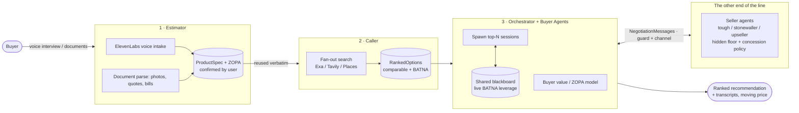

# The Negotiator

> **Voice agents that call, compare, and haggle — pick your market, never overpay again.**

Built for the **Hack-Nation 6th Global AI Hackathon** — Challenge 01, *The Negotiator*, powered by **ElevenLabs** (with the MIT Club of Northern California and the MIT Club of Germany).

An agent-to-agent negotiation system that takes a customer's requirements for a **high-consideration, quote-based product**, finds **real comparable options**, and runs **live multi-round negotiations** with seller agents — trading flexible attributes against price via ZOPA logic — then returns a ranked recommendation backed by call transcripts. The pitch-critical thing we show live: **a real price that actually moves during a negotiation**, driven by dynamics, not a script.

> **📐 Canonical build spec:** [`docs/technical-architecture.md`](docs/technical-architecture.md) (Suman) — frozen data contracts, per-owner module I/O, buyer/seller value + ZOPA models, orchestrator + shared blackboard, channels (mock/voice/UCP), honesty guard, and the hour-by-hour parallel build plan. This README is the map; that doc is the territory.

---

## The problem

Some markets never publish a real price. Moving is the best-documented example: real quotes for the *identical* 45-mile move range from **\$1,158 to \$6,506** — a 5.6× spread for the same work. Sight-unseen phone estimates are **40% more likely** to end above the quote. The only defense is to call 5–8 operators, describe the same job each time, and negotiate fee structures deliberately hard to compare. **Almost nobody does this.**

## Our vertical: **customized DTC** (config-swappable)

We picked a **customized, one-time, high-emotion purchase** — made-to-order bridal — where prices are opaque, alternatives are plentiful, and buyers have zero leverage and zero time. The buyer describes what she wants once; the agents shop and haggle. Vertical-specific parameters live in [`config/verticals/`](config/verticals/) — switching to movers, or to **B2B e-commerce packaging sourcing** (`ecommerce-packaging.json`, backed by [`negotiator/market_benchmarks.py`](negotiator/market_benchmarks.py)'s `b2b_packaging_smb` research), is a **config swap, not a rewrite**.

> **🔬 Narrowed demo scenario + market data:** [`docs/wedding-dress-research.md`](docs/wedding-dress-research.md) (Cole) — narrows the vertical to *one bride, one look, three channels that genuinely haggle* (resale / sample sale / made-to-order), with cited 2026 price bands per channel, red-flag thresholds, negotiation levers, and a runnable end-to-end scenario in [`fixtures/wedding_dress_scenario.json`](fixtures/wedding_dress_scenario.json). Builds on Jagger's [`market_benchmarks.py`](negotiator/market_benchmarks.py).

---

## Architecture — one spec, three buyer-side beats + the other end of the line



The **contracts in [`negotiator/contracts.py`](negotiator/contracts.py)** are the integration surface — freeze them first, stub outputs to match, integrate on mocks, then improve behind stable interfaces:

- **`ProductSpec`** (Estimator → Caller) — schema.org `Product` + attributes tagged hard/soft with weights & substitutions + a `negotiation` block (`target_price`, `reservation_price`).
- **`RankedOptions`** (Caller → Orchestrator) — real vendor options with `match_score` + a `channel`; the 2nd-best seeds the 1st's **BATNA**.
- **`NegotiationSession` / `NegotiationMessage`** — the runtime + transcript; `current_price` is the moving number the UI watches.

### 1 · Estimator — *intake by interview or documents* (Jagger)
Turns messy human input into a clean `ProductSpec` with ZOPA parameters. Three intake surfaces — typed/transcribed text, documents (quotes, bills, CSV inventory lists, photos), and an ElevenLabs Agents voice interview — all funnel through the *same* `estimate()` call, so they can never produce diverging specs. Extraction prefers Claude (`ANTHROPIC_API_KEY`) against the vertical's `config/verticals/*.json` schema, falling back to a deterministic heuristic extractor with no keys; missing hard constraints or price bounds are surfaced by `missing_requirements()`, and nothing reaches the Caller until `confirm_spec()` passes. → [`negotiator/estimator.py`](negotiator/estimator.py) · [`negotiator/document_intake.py`](negotiator/document_intake.py) · [`negotiator/voice_intake.py`](negotiator/voice_intake.py)

### 2 · Caller — *parallel quote gathering* (Cole)
Fans out over the web (Exa/Tavily/Serper) + business listings (Google Places/Yelp) for **real** options, scores each with the buyer value function, returns a ranked `RankedOptions`. → [`negotiator/caller.py`](negotiator/caller.py)

### 3 · Buyer Agent + Orchestrator — *negotiation & reporting* (Suman)
The Orchestrator spawns one **Buyer Agent ⇄ Seller Agent** session per top-N option, each Buyer Agent maximizing utility with **honest** leverage only (a competing quote must exist on the shared **blackboard**), applying red-flag/BATNA logic, then ranks the closed deals with transcript citations. → [`negotiator/orchestrator.py`](negotiator/orchestrator.py) · [`negotiator/agents/buyer_agent.py`](negotiator/agents/buyer_agent.py) · [`negotiator/comms/`](negotiator/comms/)

### The other end of the line — the **Seller-side agent** (Ella)
Vendor/counterparty agents with **hidden reservation prices + inventory-driven concession policies** (tough negotiator / stonewaller / upseller). A seller on aging stock has a lower `dynamic_floor` and concedes further — so the price **genuinely moves**, emergent from two private states, not a script. → [`negotiator/agents/seller_agent.py`](negotiator/agents/seller_agent.py) · [`negotiator/seller_value.py`](negotiator/seller_value.py)

---

## The conversation is the product

| Requirement | How we handle it |
|---|---|
| **Who is the agent speaking for?** | Discloses up front it's an AI on behalf of a customer; answers *"am I talking to a robot?"* honestly, without losing the quote. |
| **Surviving friction** | Barge-in, latency, turn-taking; copes with busy dispatchers who interrupt and multitask. |
| **The honesty line** | Leverage only from **real** BATNA/blackboard rows — never invents a competing bid or inventory. Enforced by the anti-injection [`guard`](negotiator/guard.py). |
| **How every call ends** | A **structured outcome** every time: itemized quote, callback commitment, or documented decline — never a vague range. |

---

## Tech stack

- **Backend:** Python + FastAPI, `asyncio` for parallel sessions.
- **Agents:** Claude via the Anthropic API (Estimator, Buyer/Seller agents).
- **Contracts:** Pydantic models mirroring schema.org `Product` + `Offer` JSON-LD.
- **Search (Caller):** Exa / Tavily / Serper / Brave; Google Places / Yelp for call lists.
- **Voice leg:** Vapi / Retell / Bland / Twilio (TTS out, STT in) — one live call.
- **Protocol:** UCP as a pluggable `SellerChannel` adapter.
- **Frontend:** Next.js, SSE/websocket for the live price ticker + transcript.

## Repo structure

```
the-negotiator/
├── negotiator/                  # the Python package (contract-first)
│   ├── contracts.py             # FROZEN Pydantic models — the integration surface
│   ├── estimator.py             # Jagger — estimate(text) -> ProductSpec (+ confirm_spec, missing_requirements)
│   ├── document_intake.py       # Jagger — document intake path: text/CSV + photo (Claude vision)
│   ├── voice_intake.py          # Jagger — ElevenLabs Agent config + voice tool-call intake path
│   ├── market_benchmarks.py     # Jagger — per-vertical price bands / red flags / BATNA guidance (pure config)
│   ├── caller.py                # Jagger — search(spec) -> RankedOptions
│   ├── buyer_value.py           # Cole + Kazi — utility / feasibility / concession (pure)
│   ├── seller_value.py          # Ella — surplus / dynamic_floor (pure)
│   ├── agents/{base,buyer_agent,seller_agent}.py
│   ├── comms/{loop,channels,blackboard}.py   # Suman — engine + Mock/Voice/UCP + blackboard
│   ├── guard.py                 # note-taker — honesty + anti-injection
│   └── orchestrator.py          # Suman — fan out top-N, rank, recommend
├── app/main.py                  # FastAPI surface for the demo UI
├── ui/                          # Next.js demo (note-taker) — table + ticker + transcript
├── tests/                       # pytest — value-model + negotiation ("done when" checks)
├── run_demo.py                  # end-to-end mock: a moving price, no keys/network
├── docs/                        # technical-architecture.md (canonical) · architecture.md · challenge-brief.md
├── config/verticals/            # config-not-code reference data (wedding-dress / moving / ecommerce-packaging)
└── pyproject.toml · requirements.txt · .env.example
```

## Getting started

```bash
git clone https://github.com/ColeLeng/the-negotiator.git
cd the-negotiator
python -m venv .venv && source .venv/bin/activate
pip install -r requirements.txt
cp .env.example .env               # fill keys when wiring the real modules

python run_demo.py                 # end-to-end MOCK — watch the price move (no keys needed)
pytest -q                          # value-model + negotiation + caller + guard checks
uvicorn app.main:app --reload      # API for the demo UI  →  GET /demo · GET /demo/stream
                                    # left-screen agent trace →  GET /trace/view

# Demo UI (separate terminal) — the dual-screen demo's RIGHT screen (transcript)
cd ui && npm install && npm run dev   # → http://localhost:3000
```

`run_demo.py` runs intake → search → parallel negotiations → ranked recommendation entirely on mocks, printing a genuinely moving price per session. Start any module by stubbing its output to the [`contracts.py`](negotiator/contracts.py) shape — downstream owners integrate against you before your logic is done.

### Dual-screen demo: the left screen (live agent trace)

`GET /trace/view` (served straight off `uvicorn`, no build step) is the **left** screen of the recorded demo — live agent-behavior visualization, distinct from the **right** screen's conversation transcript (`ui/`). It renders `negotiator/tracing.py`'s event log in real time over SSE (`GET /trace/stream`; `GET /trace` is the non-streaming fallback): session-spawn, every buyer/seller turn with its rationale, guard interventions, session outcomes, and the final recommendation. `orchestrator.run(..., tracer=...)` and `comms/loop.run_negotiation(..., tracer=...)` both take an optional `tracer` — omit it and nothing changes, so this never touches existing negotiation behavior.

## Team & roles

| Area | Owner |
|---|---|
| Data-contract freeze (`negotiator/contracts.py`) | **Suman** + Cole |
| Estimator (`estimator.py`) | **Jagger** |
| Caller (`caller.py`) | **Cole** |
| Buyer value / ZOPA model (`buyer_value.py`) | **Cole** |
| Buyer Agent + Orchestrator + loop + channels + blackboard | **Suman** |
| Seller Agent + seller value model | **Ella** |
| Honesty + anti-injection guard (`guard.py`) | **Cole** |
| Demo UI (`ui/`) | **Cole** |
| Event tracing + live agent-trace panel (`tracing.py`, `/trace/view`) | **Jagger** |

See the [Linear project](https://linear.app/citable/project/the-negotiator-hack-nation-elevenlabs-5adf25d81103) for the live task board.

## What "done" looks like

- [ ] Closed loop: **intake → search → negotiation → ranked recommendation** with transcript evidence.
- [ ] One structured `ProductSpec`, built by voice **and** ≥1 document type, confirmed and reused verbatim.
- [ ] Live calls against **≥3 distinct negotiation styles**; every quote itemized & comparable.
- [ ] **≥1 negotiation** where the price *measurably moves during the call* from real leverage — not a script.
- [ ] AI disclosure + honesty constraints hold; friction (hang-ups, refusals, "are you a robot?") handled gracefully.
- [ ] Every call ends in a structured outcome; the final report ranks all options and cites transcripts.

---

*Hack-Nation × MIT Club of Northern California × MIT Club of Germany · 6th Global AI Hackathon · Challenge 01 · powered by ElevenLabs.*
