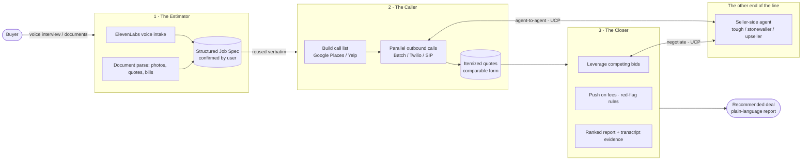

# The Negotiator

> **Voice agents that call, compare, and haggle — pick your market, never overpay again.**

Built for the **Hack-Nation 6th Global AI Hackathon** — Challenge 01, *The Negotiator*, powered by **ElevenLabs** (in collaboration with the MIT Club of Northern California and the MIT Club of Germany).

An end-to-end voice-agent system that, for a market whose real prices only exist over the phone, **gathers real quotes, reports them in comparable form, and negotiates the best deal** — closing the gap between the price you'd pay and the price you *could* have paid.

---

## The problem

Some markets never publish a real price. Moving is the best-documented example: real quotes for the *identical* 45-mile move range from **\$1,158 to \$6,506** — a 5.6× spread for the same work. Sight-unseen phone estimates are **40% more likely** to end in a final bill above the quote. The only defense is to call 5–8 operators, describe the same job each time, sit through hold music, and negotiate fee structures that are deliberately hard to compare.

**Almost nobody does this.** That gap is what The Negotiator closes — and moving is only the beachhead. The same system generalizes to any phone-priced market: **car buying, medical bills, contractor bids, freight, equipment rental, wedding vendors.**

## Our vertical: **Wedding-dress DTC** (config-swappable)

We picked a **customized, one-time, high-emotion purchase** where prices are opaque, alternatives are plentiful, and buyers have zero leverage and zero time. The buyer describes what she wants once; the agents do the shopping and haggling.

Vertical-specific parameters — taxonomy, price benchmarks, red-flag rules, negotiation levers, counterparty styles — live in **[`config/verticals/`](config/verticals/)**. Switching from wedding dresses to movers is a **config swap, not a rewrite** ([`wedding-dress.json`](config/verticals/wedding-dress.json) → [`moving.json`](config/verticals/moving.json)).

---

## Architecture — one job spec, three buyer-side beats + the other end of the line

> **📐 Canonical build spec:** [`docs/technical-architecture.md`](docs/technical-architecture.md) (Suman) — frozen data contracts, per-owner module I/O, buyer/seller value + ZOPA models, orchestrator + shared blackboard, pluggable channels (mock/voice/UCP), honesty guard, and the hour-by-hour parallel build plan. The map below is the conceptual overview; in the technical spec the **Closer** is realized as the **Buyer Agent + Orchestrator + negotiation loop**, coordinating through a shared **blackboard** for live, honest BATNA leverage.



The **[Structured Job Spec](schemas/job-spec.schema.json)** is the contract that ties the buyer-side modules together: built once (by voice **and** at least one document type), **confirmed by the user**, then **reused verbatim** on every call so every quote is for the exact same job. The buyer agents negotiate against a **seller-side counterparty agent** — ideally over **UCP (Universal Commerce Protocol)** — which is what makes a price actually move.

### 1 · The Estimator — *intake by interview or documents*
An intake agent builds a complete, structured job spec — the thing that makes a later quote *binding rather than bait*. Two paths, both producing the **same** spec:
- **Voice interview** on the ElevenLabs Agents Platform — asks what a professional estimator would ask.
- **Document intake** — photos, existing quotes, bills, inventory lists → parsed via vision/OCR into the identical schema.

The user **confirms the spec** before any call is made. → [`packages/estimator`](packages/estimator/)

### 2 · The Caller — *parallel quote gathering*
Phones the market and extracts an **itemized, comparable quote** from each call. The call list is built programmatically (Google Places / Yelp), calls run in parallel (Batch Calling / Twilio / SIP), and the agent survives real friction — interruptions, "someone will call you back", vague answers. Demonstrated against **≥3 distinct counterparty styles**: the tough negotiator, the stonewaller who won't give prices by phone, the hard-sell upseller. → [`packages/caller`](packages/caller/)

> **Two research approaches, one comparable output.** Phone inquiry (non-transparent data) *and* AI-search / exposed-API fan-out both land as citations in the same quote store — so the buyer gets one apples-to-apples table regardless of how the price was sourced.

### 3 · The Closer — *negotiation & reporting*
With quotes in hand, the agent **negotiates**: leverages one bid against another ("I have a binding quote for \$850 — can you beat it?"), pushes on fees, applies **red-flag rules** (any quote 30%+ below market is a *warning*, not a win), and produces a **ranked report** the buyer can trust — recommended deal, full transcripts and recordings, itemized fee breakdowns, and a plain-language explanation of *why*. → [`packages/closer`](packages/closer/)

### The other end of the line — *the Seller-side agent*
The counterparty, built as agents rather than a script. Vendor/seller agents take the Caller's calls and hold the line against the Closer — the **tough negotiator**, the **stonewaller** who won't price by phone, the **hard-sell upseller**. Running the buyer agents *against* real seller agents — ideally negotiating over **UCP (Universal Commerce Protocol)** — is what makes a price actually move during a call, instead of a scripted screenplay. Voice (ElevenLabs) is the required top layer; the agent-to-agent negotiation logic underneath is the reusable, Citable-relevant bet. → [`packages/seller-agent`](packages/seller-agent/)

---

## The conversation is the product

Voice is not a skin on a chatbot — it's the mechanism of trust on both ends of the call. Four things we handle explicitly (see [`docs/architecture.md`](docs/architecture.md#the-conversation-requirement)):

| Requirement | How we handle it |
|---|---|
| **Who is the agent speaking for?** | Discloses up front that it's an AI calling on behalf of a customer; answers *"am I talking to a robot?"* gracefully and honestly, without losing the quote. |
| **Surviving friction** | Barge-in handling, low latency, turn-taking; copes with busy dispatchers who interrupt, answer vaguely, and multitask. |
| **The honesty line** | May use competing bids as leverage — but **never** invents inventory, fakes a bid, or misrepresents the job. Constrained in code and prompt. |
| **How every call ends** | A **structured outcome** every time: an itemized quote, a callback commitment, or a documented decline — never a vague *"they said around two thousand."* |

---

## Tech stack

- **[ElevenLabs Agents Platform](https://elevenlabs.io/docs)** — conversational agents: system prompts, tools, knowledge bases, agent transfer, human handoff.
- **Batch Calling / Twilio / SIP** — parallel real outbound calls.
- **Agent Tools & MCP** — log structured quotes mid-call, look up price benchmarks, write results to the comparison backend.
- **Google Places / Yelp Fusion / OSM** — build the call list programmatically (business numbers, categories, ratings by location).
- **Vision / OCR** — turn photos, existing quotes, and bills into the structured job spec.
- **TypeScript monorepo** (npm workspaces) with a shared, typed job-spec + quote model.

## Repo structure

```
the-negotiator/
├── docs/
│   ├── architecture.md        # data flow, the conversation requirement, honesty constraints
│   └── challenge-brief.md      # the hackathon challenge, summarized
├── schemas/
│   └── job-spec.schema.json    # THE contract — one spec, reused verbatim across every call
├── config/verticals/
│   ├── wedding-dress.json       # primary vertical (DTC)
│   └── moving.json              # second vertical — proves "config, not code"
├── packages/
│   ├── shared/                  # typed JobSpec, Quote, NegotiationOutcome models
│   ├── estimator/               # module 1 — intake (voice + documents) → job spec
│   ├── caller/                  # module 2 — parallel quote gathering
│   ├── closer/                  # module 3 — negotiation + ranked report
│   └── seller-agent/            # the other end of the line — counterparty vendor agents
└── evals/                       # golden calls + eval sets (fee extraction, red-flag detection)
```

## Getting started

```bash
git clone https://github.com/ColeLeng/the-negotiator.git
cd the-negotiator
cp .env.example .env      # fill in ElevenLabs, Twilio, Google Places keys
npm install               # installs all workspaces
```

Each module has its own README with what it owns and how to run it. Start with the [Structured Job Spec](schemas/job-spec.schema.json) — it's the interface every module agrees on.

## Team & roles

| Area | Owner |
|---|---|
| Infra — ElevenLabs + telephony + market-discovery keys | **Cole** |
| The Estimator — voice + document intake → job spec | **Jagger** |
| The Caller — call list + parallel quote-gathering fan-out | **Cole** |
| The Closer — negotiation loop + ranked reporting | **Suman** |
| Seller-side agent — counterparty vendor agents, agent-to-agent via UCP | **Ella** |
| Market research — UCP/ZOPA, market sizing (\$ & #), one-time/custom markets | **Jagger** |
| Demo + eval harness — golden calls, 3 styles, final report | *up for grabs* |

See the [Linear project](https://linear.app/citable/project/the-negotiator-hack-nation-elevenlabs-5adf25d81103) for the live task board.

## What "done" looks like

- [ ] Closed loop: **intake → calls → negotiation → ranked recommendation** with transcript evidence.
- [ ] **One** structured job spec, built by voice **and** ≥1 document type, confirmed by the user, reused verbatim on every call.
- [ ] Live calls demonstrated against **≥3 distinct negotiation styles**; every quote captured in structured, comparable form with fees itemized.
- [ ] **≥1 negotiation** where price or terms *measurably change during the call* because of leverage the agent gathered — not because the script said so.
- [ ] AI disclosure + honesty constraints hold; friction (hang-ups, refusals, "are you a robot?") handled gracefully.
- [ ] Every call ends in a structured outcome; final report ranks all quotes and cites recordings/transcripts.

---

*Hack-Nation × MIT Club of Northern California × MIT Club of Germany · 6th Global AI Hackathon · Challenge 01 · powered by ElevenLabs.*
